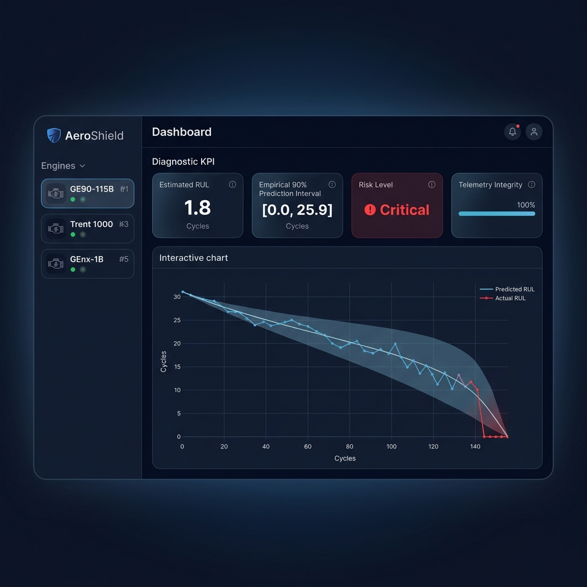
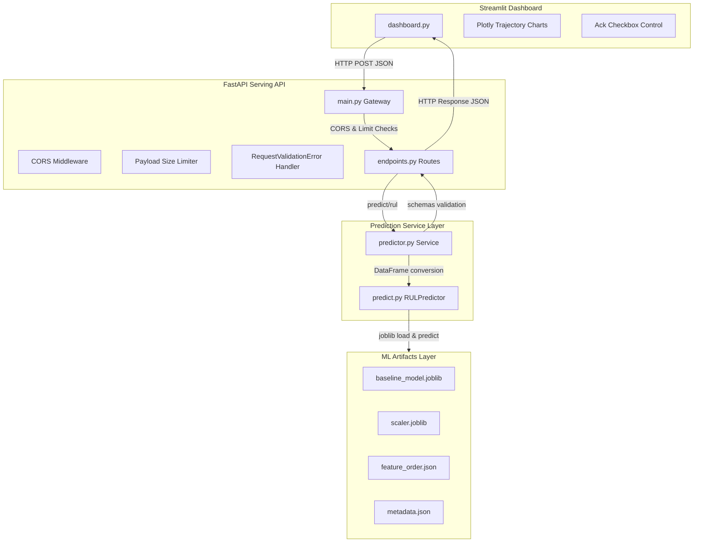

# AeroShield: Predictive Maintenance Serving Gateway & Dashboard

AeroShield is a production-grade predictive maintenance analytics application designed for serving machine learning models that predict the Remaining Useful Life (RUL) of industrial equipment (e.g., turbofan jet engines based on C-MAPSS FD001 dataset).

It is built with a decoupled architecture featuring a **FastAPI** model serving backend and an **Apple-inspired dark-mode Streamlit** dashboard for human review and analysis.

---

## 📺 Interface Preview

Here is a preview of the AeroShield Streamlit control panel showing RUL estimates, empirical 90% prediction intervals, and interactive Plotly telemetry:



---

## 🏗️ Architecture Overview

The system uses a clean, decoupled design separating data simulation/visualization, the API Gateway layer, and the ML prediction services:



---

## 🚀 Setup & Execution Guide

### Prerequisites
- Python 3.10 to 3.12 (standard virtual environment)
- Active network access to download packages if needed

### 1. Installation
Clone the repository and install the pinned, compatible dependencies:
```bash
pip install -r requirements.txt
```

### 2. Launch FastAPI Serving Backend
Start the uvicorn gateway server locally:
```bash
uvicorn backend.app.main:app --port 8000 --reload
```
- The API is served at `http://localhost:8000`.
- The interactive OpenAPI documentation is available at `http://localhost:8000/docs`.

### 3. Launch Streamlit Dashboard
Open another terminal and launch the dashboard:
```bash
streamlit run frontend/dashboard.py
```
- The dashboard is accessible at `http://localhost:8501`.
- It will automatically connect to the backend server.

---

## 🧪 Verification & Testing

Verify system functionality using our automated test suite:
```bash
python -m pytest tests/test_api.py
```
The test suite covers:
- `/health` status and loading check.
- `/model-info` validation parameters.
- `/predict/rul` endpoints using official payloads.
- Rejection of malformed matrices and non-finite numbers (NaN/Inf).
- Simulated missing artifacts behavior (graceful 503 response, health stays active).

---

## 📄 API Contracts Specification

### 1. Health Status check
- **Route**: `GET /health`
- **Response Schema**:
  ```json
  {
    "status": "healthy",
    "api_version": "1.0.0",
    "model_loaded": true
  }
  ```

### 2. Model Information
- **Route**: `GET /model-info`
- **Response Schema**:
  ```json
  {
    "model_name": "RandomForestRegressor_FD001",
    "model_version": "1.3.0",
    "framework": "Scikit-Learn (RandomForestRegressor)",
    "description": "Predicts the Remaining Useful Life (RUL) of turbofan engines using time series sensor windows.",
    "expected_window_size": 30,
    "expected_num_features": 16,
    "metrics": {
      "MAE": 12.35,
      "RMSE": 17.06
    }
  }
  ```

### 3. Predict Remaining Useful Life
- **Route**: `POST /predict/rul`
- **Request Payload**:
  ```json
  {
    "engine_id": 54,
    "cycle": 257,
    "sensor_window": [
      [0.0009, -0.0003, 643.8, ...], // 16 values in feature order
      ... // Repeated 30 times (WINDOW_SIZE = 30)
    ]
  }
  ```
- **Response Payload**:
  ```json
  {
    "engine_id": 54,
    "cycle": 257,
    "estimated_rul": 1.82,
    "prediction_interval_lower": 0.0,
    "prediction_interval_upper": 25.9,
    "prediction_interval_level": 0.90,
    "prediction_interval_coverage": 0.8998,
    "prediction_interval_description": "Bounds use validation-residual 5th and 95th percentiles.",
    "sequence_conversion_strategy": "The Random Forest converts the (30, 16) sequence into a single RUL prediction by extracting the final cycle (cycle 30 snapshot) from the rolling window.",
    "risk_level": "Critical",
    "data_quality_score": 1.0,
    "recommendation": "CRITICAL ALERT: RUL <= 15 cycles. Require immediate qualified engineering inspection and detailed diagnostic checks before further flight operation.",
    "model_name": "RandomForestRegressor_FD001",
    "model_version": "1.3.0"
  }
  ```

---

## 🔒 Security Controls

1. **PII Data Minimization**: Avoids collecting personally identifiable info (PII) by employing a non-identifying, transient review checkbox on the dashboard instead of standard signature forms.
2. **CORS Isolation**: Restricts Allowed CORS origins strictly to Streamlit client addresses to prevent cross-origin scripting attacks.
3. **Payload Sanitization**: FastAPI sanitization limits requests to a maximum size of 1MB, preventing buffer overflow or denial-of-service (DoS) payloads.
4. **Exception Traceback Masking**: Replaces internal python stack trace disclosures with sanitized server error responses (HTTP 500/503), preventing attackers from gaining structural details of the backend file hierarchy.
